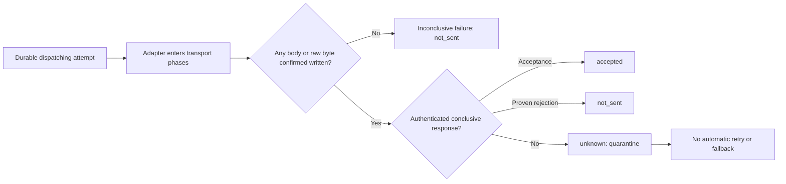

# Provider SPI and conformance

Provider packages implement one or more public adapter surfaces and register them as one exact
provider ID, semantic adapter version, and mode. A descriptor must claim only the surfaces that the
registration actually implements. A mode that lacks a hard requirement remains non-activatable;
operator approval cannot turn missing transport behavior into a capability.

## Dispatch truth

The dispatch boundary is evidence, not exception interpretation:

The execution wrapper also validates that every submitted recipient appears exactly once in either
accepted or rejected outcomes. Malformed, missing, overlapping, or duplicate outcomes after the
boundary are unknown.

## Qualification and activation

The conformance kit derives mandatory checks from each descriptor. Inbound claims require one-shot
ownership and streamed-limit probes. Outbound claims require pre-boundary, post-boundary,
recipient-outcome, and unknown-quarantine probes. Feedback, control-plane, per-recipient, and
reconciliation claims add their own executable checks.

Reports are sorted and canonicalized before signing. Activation verifies the report schema, nested
digests, descriptor digest, mode, freshness window, Ed25519 signature, and every required check.
Stable descriptor evidence may cover at most 30 days; experimental evidence may cover at most 7
days.

The package deliberately does not perform provider network calls on its own. An adapter target
supplies protocol-specific requests and controlled scenario selection, while the kit invokes the
real public adapter methods and independently inspects stream ownership, normalized results,
transport boundary state, and observable control-plane state.

Feedback drivers may supply one provider-native request or an ordered list of requests. The harness
normalizes each request through the real adapter, then applies the shared identity deduplication and
ordering rules to the combined events. This keeps single-event webhook protocols conformant without
inventing an undocumented provider batch format.

Control-plane mutation probes require an explicit protected qualification or sandbox marker. They
also require a verifiable SHA-256 control-state digest: absence of that digest cannot qualify
planning determinism, read-only discovery, or observable mutation. Every returned plan is validated
against the registered provider/version/mode, desired-state digest, observation time, expiry, and
canonical operation order before it can reach `applyBindingPlan`.

All adapter-owned conformance callbacks receive the run signal and deadline. The harness races each
callback against the finite run budget, validates observation and derived time windows before
building fixtures, and reports invalid time input as an explicit failed `Result`. Signed environment
evidence accepts only documented deployment dimensions and hashes their values with a
domain-separated SHA-256 policy, preventing credentials and arbitrary environment values from
entering the report.

## W5-W8 reconciliation transaction boundary

`PostgresDurableRuntimeStore.applyReconciliation` closes the former composition gap. The provider
evaluator still is not authorization to write: the concrete writer enforces all of the following in
the transaction that changes durable state:

1. Retain the exact query context plus the orchestration claim fence, and require its attempt ID,
   route binding identity, tenant, and claimed fence to equal the currently persisted attempt.
2. Require evidence `observedAt` to be valid, inside the requested reconciliation window, no later
   than the orchestration clock, and fresh under the deployment's documented maximum age.
3. Re-read the attempt and binding in the write transaction, reject superseded attempts or changed
   binding/config revisions, and apply only authoritative certainty declared by that exact adapter
   descriptor.
4. Persist the reducer transition, decision evidence, current attempt ID, dispatch fence,
   reconciliation claim fence, and expected workflow version atomically. A conflict or stale
   observation preserves `quarantined_unknown`; it never retries or resolves a newer attempt.

The runtime retains adapter mode, dispatch transport, configuration revision, capability digest, and
the exact query window in its claim. Unknown or non-authoritative evidence clears no quarantine and
schedules no dispatch.
