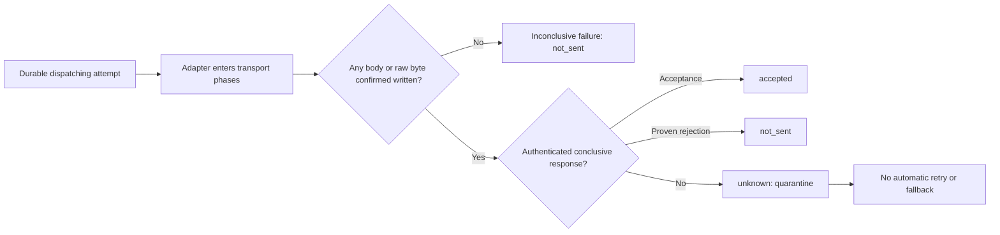

# Provider SPI and conformance

Provider packages implement one or more public adapter surfaces and register them as one exact
provider ID, semantic adapter version, and mode. A descriptor must claim only the surfaces that the
registration actually implements. A mode that lacks a hard requirement remains non-activatable;
operator approval cannot turn missing transport behavior into a capability.

## Dispatch truth

The dispatch boundary is evidence, not exception interpretation:

The execution wrapper also validates that every submitted recipient appears exactly once in either
accepted or rejected outcomes. Malformed, missing, overlapping, or duplicate outcomes after the
boundary are unknown.

## Qualification and activation

The conformance kit derives mandatory checks from each descriptor. Inbound claims require one-shot
ownership and streamed-limit probes. Outbound claims require pre-boundary, post-boundary,
recipient-outcome, and unknown-quarantine probes. Feedback, control-plane, per-recipient, and
reconciliation claims add their own executable checks.

Reports are sorted and canonicalized before signing. Activation verifies the report schema, nested
digests, descriptor digest, mode, freshness window, Ed25519 signature, and every required check.
Stable descriptor evidence may cover at most 30 days; experimental evidence may cover at most 7
days.

The package deliberately does not perform provider network calls on its own. An adapter target
supplies protocol-specific requests and controlled scenario selection, while the kit invokes the
real public adapter methods and independently inspects stream ownership, normalized results,
transport boundary state, and observable control-plane state.
