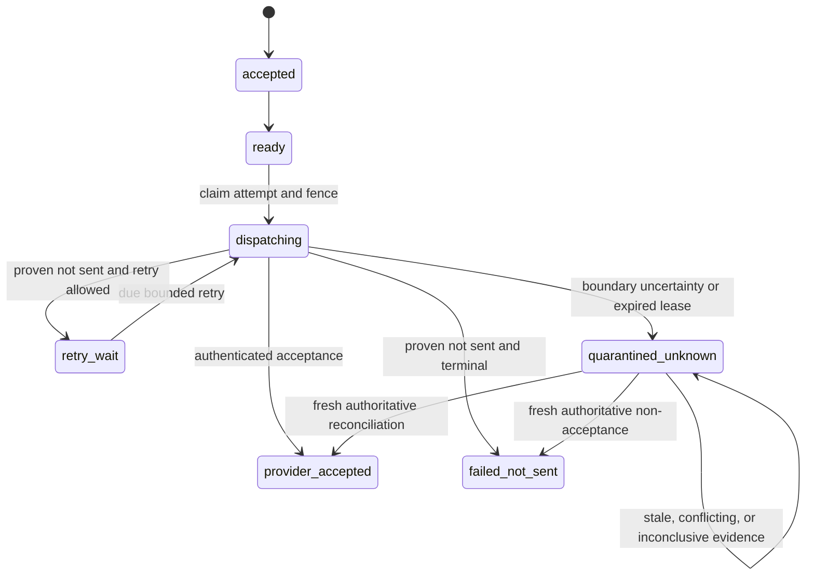

# Durable runtime orchestration

The W5-W8 runtime composes the existing reducers, provider SPI, PostgreSQL writer, versioned S3
storage, and pg-boss wakeups. PostgreSQL remains authoritative; a pg-boss job is only a replaceable
identifier-only hint.



Unknown is intentionally a quarantine loop. Neither lease recovery nor reconciliation invents a new
dispatch. A separately authorized reducer event would be required before another attempt.

## Database authority and grants

Run migrations as the owner. Grant the runtime role only table DML, schema usage, pg-boss access,
and these two narrow functions:

```sql
GRANT EXECUTE ON FUNCTION mail_edge_locate_workflow(text, uuid) TO mail_edge_runtime;
GRANT EXECUTE ON FUNCTION mail_edge_active_tenants(uuid, integer) TO mail_edge_runtime;
```

`mail_edge_locate_workflow` returns only the tenant UUID for one opaque workflow UUID. It does not
return mail or provider data. The worker then opens `executeForTenant`, which installs
transaction-local RLS context and a finite statement deadline. `mail_edge_active_tenants` supplies
bounded maintenance pages; each task still opens its own tenant transaction.

Do not grant either function to `PUBLIC`, do not let the runtime role own tables or bypass RLS, and
do not set `app.tenant_id` at session scope.

## Composition order

Construct the adapters without I/O, then start them through `DurableRuntimeHost` in this order:

1. PostgreSQL and versioned S3 lifecycle resources.
2. Exact provider registry lifecycle.
3. pg-boss and the four wakeup handlers: inbound receipt, outbound intent, feedback event, and
   application delivery.
4. Bounded tenant maintenance: reconciliation, lease recovery, retention, orphan reaping, promotion
   repair, stage cleanup, and wakeup repair.

Use one shared `BoundedWorkLimiter` for expensive work or deliberately partition finite capacity by
workflow. `NamedTenantMaintenanceTask` adapts existing blob workers and the reconciliation/recovery
workers without copying their logic. `DurableWakeupRepairTask` joins
`PostgresWakeupRepairRepository` to `PgBossWakeupScheduler.publishRepair`. The coordinator advances
a bounded UUID cursor across active tenants; it records and returns the first task error but still
completes the current page so one failing tenant cannot starve later tenants.

The executable composition shape is:

```ts
const store = new PostgresDurableRuntimeStore({ unitOfWork, cipher, digester });
const queue = new PgBossWakeupScheduler(queueConfig, unitOfWork, queueErrors);
const limiter = new BoundedWorkLimiter(config.maximumConcurrentWork);

const recovery = new DurableLeaseRecoveryWorker({
  clock,
  config,
  limiter,
  observability,
  store,
  transactions: unitOfWork,
  wakeups: queue,
});
const reconciliation = new DurableReconciliationWorker({
  clock,
  config,
  limiter,
  observability,
  providers,
  store,
  transactions: unitOfWork,
});
const wakeupRepair = new DurableWakeupRepairTask({
  clock,
  limit: config.recoveryBatchSize,
  queue,
  source: new PostgresWakeupRepairRepository(unitOfWork),
});

const maintenance = new DurableMaintenanceCoordinator({
  config,
  observability,
  schedule: { intervalMilliseconds: 30_000, tenantBatchSize: 100 },
  tasks: [
    new NamedTenantMaintenanceTask("lease_recovery", recovery),
    new NamedTenantMaintenanceTask("reconciliation", reconciliation),
    new NamedTenantMaintenanceTask("wakeup_repair", wakeupRepair),
    new NamedTenantMaintenanceTask("retention", retentionWorker),
    new NamedTenantMaintenanceTask("orphan_reaping", orphanReaper),
    new NamedTenantMaintenanceTask("promotion_repair", promotionRepair),
    new NamedTenantMaintenanceTask("stage_cleanup", stageCleanup),
  ],
  tenants: store,
});
```

Construct the inbound, outbound, feedback, and application-delivery workers with the same store,
unit of work, queue, exact provider registry, clock, ID source, and required narrow ports. Register
them with the host; do not call provider adapters or database repositories from global callbacks.

## Failure and recovery runbook

- If a process exits while routing inbound mail or delivering to an application, lease recovery
  advances durable state to a bounded retry and transactionally schedules its wakeup. Repeated
  expirations stop at the configured attempt ceiling and dead-letter the workflow.
- If it exits while provider dispatch is active, recovery quarantines the attempt as unknown and
  emits no outbound wakeup.
- If feedback or reconciliation application expires, recovery releases only that claim. Feedback
  receives an identifier wakeup; reconciliation is picked up by the bounded tenant pass.
- If a queue insertion is lost after a separately committed older workflow, wakeup repair scans
  durable due state and republishes the opaque ID. New runtime transitions schedule pg-boss inside
  their PostgreSQL transaction.
- If reconciliation evidence is outside its retained query window, newer than the orchestration
  clock, too old, from another adapter authority, or races a newer workflow version/fence, the write
  fails and the attempt remains quarantined.
- Feedback projection replays at most 10,000 retained events for one intent and recipient. Crossing
  that guard fails closed with `WORKFLOW_CONFLICT`; compact or archive the retained history before
  retrying rather than accepting a truncated projection.

Alert on `quarantined` outcomes, expired outbound leases, reconciliation claim churn, maintenance
`lastFailure`, `RATE_LIMITED`, wakeup backlog age, and graceful shutdown deadline failures. Metrics
must use bounded workflow/operation labels only; identifiers belong in access-controlled audit data,
not metric labels.
